> 이 블로그는 [여기](https://tech.blueprint-lab.com/connect-webcam-to-docker-on-mac-or-windows)에서 작성한 글을 약간 수정하였습니다.

- _2019. 07. 27 Updated English version in [here](https://medium.com/@jijupax/connect-the-webcam-to-docker-on-mac-or-windows-51d894c44468)_

#### 목차

- [개요](#개요)
- [문제점](#문제점)
- [해결 방안](#해결-방안)
  - [MacOS](#macos)
  - [Windows](#windows)
- [정리](#정리)
  - [Webcam 테스트](#webcam-테스트)
  - [결론](#결론)
  - [요약](#요약)
- [참고](#참고)

Mac 또는 Windows 환경에서 webcam을 Docker에 연결하는 것은 자주 쓰이지 않을 상황일 수도 있지만 꼭 필요한 경우가 있습니다.
그런데 구글링을 해봐도 자세한 설명을 찾기 힘들어서 기나긴 삽질을 시작했고, 다소 복잡하지만 그 방법에 대해 최대한 자세하게 설명을 하려고 합니다.

### 개요

[GitHub](https://github.com/)를 서핑하다보면, 튜토리얼이 잘 구성되어 있는 오픈소스 코드가 많이 있습니다. 제가 관심이 많은 [Computer Vision 분야](https://github.com/search?q=computer+vision)는 주로 Ubuntu 환경을 권장하는 코드가 대부분입니다.

Machine Learning 코드라면 회사에서 사용하는 Linux 머신이나 공짜 GCP 크레딧을 사용하겠지만 Visualization이 필요한 상황에서는 귀찮은 일이 많아졌습니다. 왜냐하면 저는 주로 Macbook Pro를 사용하여 작업 환경의 자유도가 높은 상황이라 테스트용으로 이미지를 출력할땐 로컬에서 보는 것을 선호하였고, 팀 차원에서 코드를 공유해서 작업하다 보니 자연스럽게 [Docker](https://www.docker.com/)를 사용하고 있습니다.

[top](#)

### 문제점

여기서 __webcam__(웹캠, 카메라)을 연결하여 잘 동작하는지 확인하는 용도 또는 서비스가 되야하는 상황이라면, `docker run` 명령에서 `--device=/dev/video0:/dev/video0` 라는 옵션을 써야하는데 MacOS와 Windows는 `/dev/video0` 라는 경로가 없기 때문에 해당 경로를 찾을 수 없다는 오류 메세지가 나오고, 아무리 검색을 해봐도 친절한 설명을 찾을 수 없습니다.

잘 사용하고 있는 Macbook Pro를 이거 때문에 바꿔야 할까요? Windows 랩탑이면, 듀얼부팅을 할 수도 있지만 다른 운영체제를 사용하기 위해 매번 Shutdown을 하는 것은 더 큰 문제가 올 수도 있습니다.

이 글에서는 비록 귀찮은 환경을 세팅해야하는 과정이 필요하지만, 현재 사용하고 있는 MacOS와 Windows 운영체제에서 webcam을 Docker에 연결하는 방법을 소개하려고 합니다. 🤓

[top](#)

### 해결 방안

#### MacOS

우선 [Docker Desktop for Mac](https://docs.docker.com/docker-for-mac/install/), [VirtualBox](https://www.virtualbox.org/), [VirtualBox Extension](https://www.virtualbox.org/wiki/Downloads)이 설치되어 있어야 하고, 아래와 같이 `socat` [1][1], `xquartz` [2][2] 를 설치해줘야 합니다. 여기서는 터미널을 사용하여 환경 구성하는 것을 권장합니다.

```sh
brew install socat
brew install xquartz
```

그런 다음 터미널에서 아래와 같이 __XQuartz__ 실행시켜 주면, 새로운 터미널 창이 뜨게 되는데 이 후의 글에서는 이것을 __터미널 2__, 기존의 터미널 세션을 __터미널 1__ 라고 하겠습니다.

```sh
open -a XQuartz
```

__XQuartz Preferecens__ 에서 아래의 그림과 같이 체크박스 선택을 해줍니다.

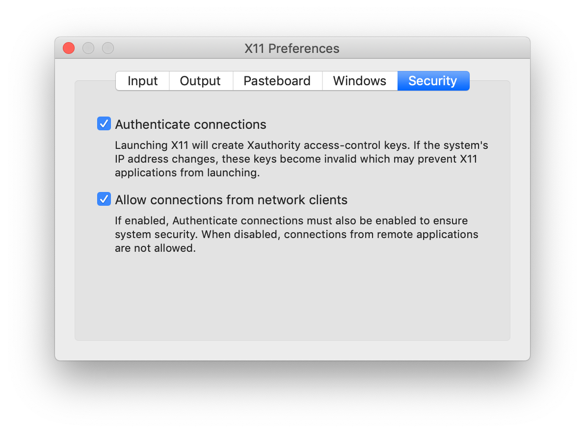

다시 __터미널 1__ 에서 아래와 같은 script를 실행시켜 줍니다.

```sh
defaults write org.macosforge.xquartz.X11 enable_iglx -bool true
```

__터미널 1__ 에서 아래와 같은 환경 변수 설정을 하는데, 앞으로 만들 `docker-machine`을 이름도 정해주세요.

```sh
IP=$(ifconfig en0 | grep inet | awk '$1=="inet" {print $2}')
xhost + $IP

# name of docker-machine, possible to change the name if you want
DOCKER_MACHINE=webcam  # (default) DOCKER_MACHINE=default
```

기본적으로 Docker Desktop for Mac은 VirtualBox를 쓰지 않습니다, 여기에서는 VirtualBox에서 가상 머신을 만들어 사용하기 때문에 아래와 같이 가상 머신을 만들어주는 명령어를 실행해 주세요.

```sh
docker-machine create -d virtualbox \
  --virtualbox-cpu-count=2 \
  --virtualbox-memory=2048 \
  --virtualbox-disk-size=100000 \
  --virtualbox-boot2docker-url https://github.com/gzupark/boot2docker-webcam-mac/releases/download/18.06.1-ce-usb/boot2docker.iso \
  ${DOCKER_MACHINE}
```

Mac에서 webcam을 사용하기 위해 일부 수정한 내용의 `boot2docker`를 다운받아서 실행하느라 다소 시간이 걸립니다. 작업이 완료 된 후 `docker-machine ls` 명령어로 `${DOCKER_MACHINE}`이름으로 생성된 것을 확인한 후 아래의 명령어로 docker-machine을 정지시켜 줍니다.

> 자세한 수정한 내용을 알고 싶으면 [링크](https://github.com/gzupark/boot2docker-webcam-mac/blob/master/README.md)를 읽어주세요.

```sh
docker-machine stop ${DOCKER_MACHINE}
```

docker-machine이 정지되었다면, VirtualBox를 실행하여 아래의 그림들처럼 설정해주세요.

> 미리 설치되어 있는 환경이라 이미지의 개수와 이름이 다를 수 있고, memory가 다를 수도 있습니다.

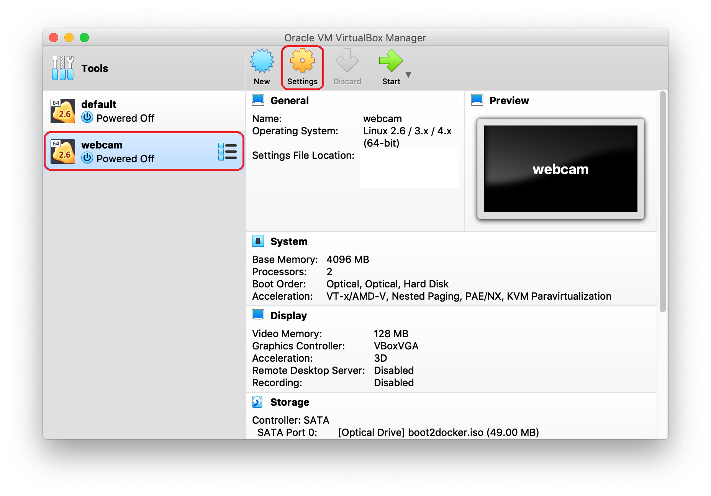
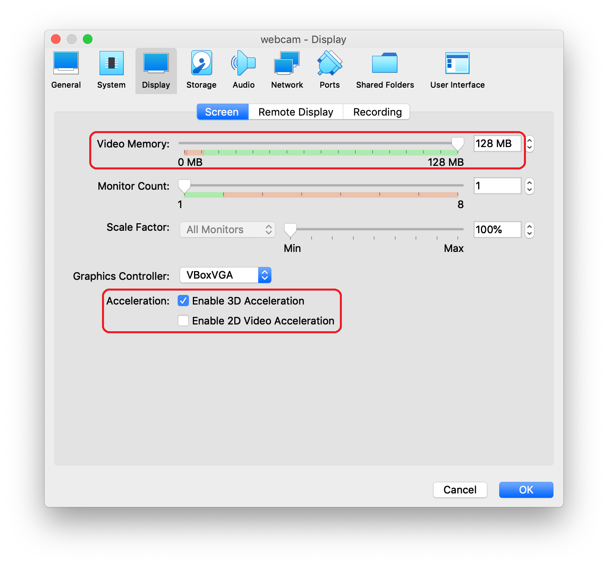
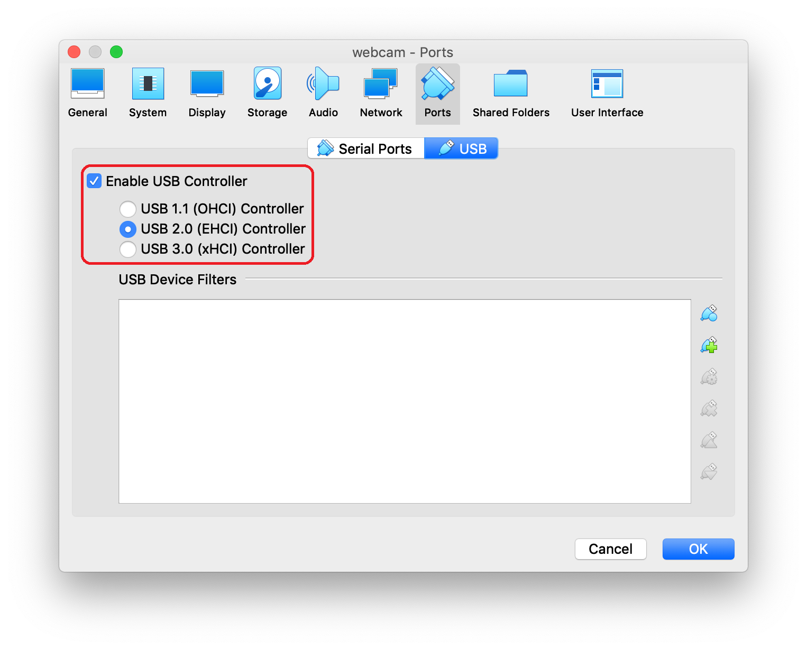
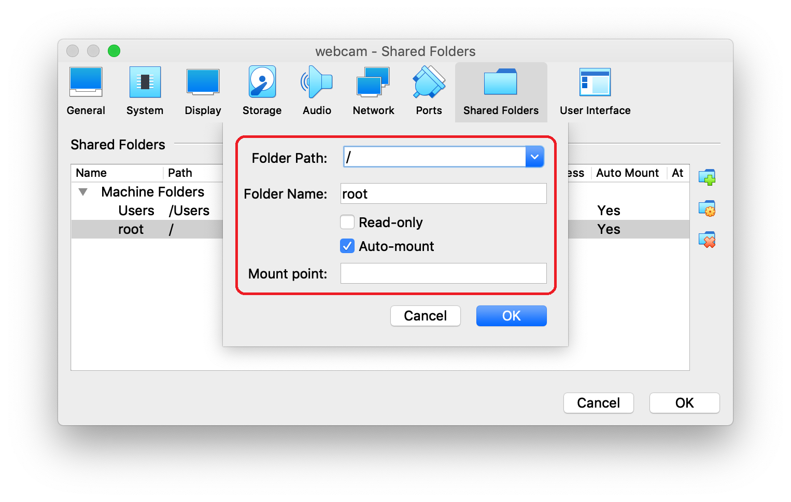

드디어 기본적인 환경 구성은 끝났습니다! 이제부터 webcam을 사용하고 싶을 때 매번 수행해야하는 과정들입니다.

1. __터미널 1__ `open -a XQuartz`
2. __터미널 2__ `socat TCP-LISTEN:6000,reuseaddr,fork UNIX-CLIENT:\"$DISPLAY\"`
    - 만약 에러가 발생하면, `lsof -i tcp:6000`을 확인하여 해당 PID를 `kill` 해주세요.
3. __터미널 1__ `IP=$(ifconfig en0 | grep inet | awk '$1=="inet" {print $2}')`
4. __터미널 1__ `xhost + $IP`
5. __터미널 1__ `DOCKER_MACHINE=webcam`
6. __터미널 1__ `docker-machine start ${DOCKER_MACHINE}`
7. __터미널 1__ `eval $(docker-machine env ${DOCKER_MACHINE})`
8. __터미널 1__ `vboxmanage list webcams` 결과 확인, _아래 예시 참조_
9. __터미널 1__ `vboxmanage controlvm "${DOCKER_MACHINE}" webcam attach .1` 또는 `.2` 또는 둘 다

> 8번 출력 예시

```sh
# choose one or all if you want (two cameras in my case)
Video Input Devices: 2
.1 "USB Camera"
.2 "FaceTime HD Camera"
```

이제 __터미널 1__ 에서 원하는 docker image를 가지고 실행하면 됩니다.

webcam 테스트 이전에 XQuartz가 제대로 동작하고 있는지 확인해 보려면 아래의 두 가지 테스트를 해보고 정상 동작하는 것을 확인해주세요.

```sh
# xeyes
docker run --rm -it -e DISPLAY=$IP:0 gns3/xeyes

# firefox
docker run --rm -it -e DISPLAY=$IP:0 -v /tmp/.X11-unix:/tmp/.X11-unix jess/firefox
```

webcam을 사용할 docker image가 있다면, 아래 예시와 같이 해주시면 됩니다.

```sh
docker run --rm -it --device=/dev/video0:/dev/video0 \
  -v /tmp/.X11-unix:/tmp/.X11-unix \
  -e DISPLAY=$IP:0 \
  ${DOCKER_IMAGE}
```

> 이 글에서는 docker 명령어에 대해 자세히 설명하지 않겠습니다.

[top](#)

#### Windows

> 참고로 Window 10 Home에서 따라해볼 수 있는 환경입니다. Pro와 Enterprise에서는 확인해보지 않았습니다.

Windows에서는 MacOS와 다르게 [Docker Toolbox on Windows](https://docs.docker.com/toolbox/toolbox_install_windows/)로 설치를 하고, 그 외의 [VirtualBox](https://www.virtualbox.org/), [VirtualBox Extension](https://www.virtualbox.org/wiki/Downloads)는 똑같이 설치해주세요.

Docker Toolbox는 `C:\Program Files\Docker Toolbox` 경로에 설치되고 나면, 시작 메뉴에서 __Docker Quickstart Terminal__ 을 실행시켜 줍니다.
그러면, VirtualBox에서 default라는 이름의 가상 환경을 시작하게 되는데 처음 실행하는 것이라면, 가상 환경을 만드느라 다소 시간이 걸립니다.

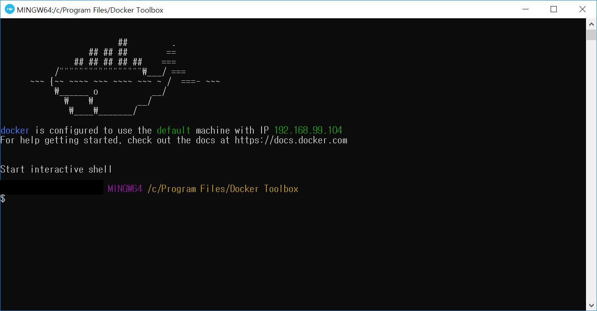

아쉽게도 Docker Quickstart Terminal을 처음 시작할 때 사용하는 [boot2docker](https://github.com/boot2docker/boot2docker)의 이미지는 webcam을 쓸 수 없기 때문에 새로운 가상 환경을 만들어줘야 합니다.
기존의 __default__ 이름으로 사용하느냐 새로운 이름을 지정해서 사용하느냐는 선택하시면 됩니다. Docker Toolbox Terminal에서 다음과 같이 실행해주세요.

- default 이름 사용

```sh
docker-machine stop default
docker-machine rm default
DOCKER_MACHINE=default
```

- __(권장)__ 새로운 이름 사용

```sh
docker-machine stop default
# name of docker-machine, possible to change the name if you want
DOCKER_MACHINE=webcam
```

위의 두 가지 선택사항 중 하나를 실행했다면, 아래의 script를 실행하여 새로운 가상 환경을 생성해 줍니다.

```sh
docker-machine create -d virtualbox \
  --virtualbox-cpu-count=2 \
  --virtualbox-memory=2048 \
  --virtualbox-disk-size=100000 \
  --virtualbox-boot2docker-url https://github.com/Alexoner/boot2docker/releases/download/v17.06.0-ce-usb-rc5/boot2docker.iso \
  ${DOCKER_MACHINE}
```

아래의 그림을 보면, 두 가지의 가상 환경이 있고 새로 만든 가상 환경인 __webcam__ 은 `STATE`가 `Running`인데 `ACTIVE`는 `-` 표시로 되어 있습니다. 꼭 확인하고 `eval $(docker-machine env ${DOCKER_MACHINE})` 명령어를 실행해 주세요.

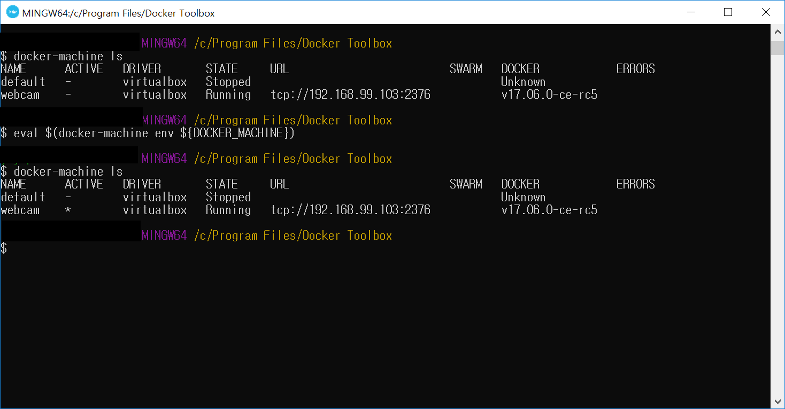

다시 그림을 보면, `ACTIVE`에서 `*`로 바뀌어 있고, `URL`을 확인할 수 있습니다. 이 경우엔 `192.168.99.103`이지만 상황에 따라 다른 주소값을 가지고 있을 수 있습니다. 아래의 명령어로 확인해주세요.

```sh
docker-machine ls | grep ${DOCKER_MACHINE} | awk '{print $5}'
# tcp://192.168.99.103:2376
```

이제 [Xming](https://sourceforge.net/projects/xming/) [5][5] 을 설치해주세요. 그러면, `C:\Program Files (x86)\Xming` 경로에 설치가 되어 있을 것이고, 거기에 있는 `x0.hosts`라는 파일을 관리자 권한으로 열어서 아래와 같이 수정해주세요.

> 위에서 확인한 URL 주소를 사용해주세요.

```txt
localhost
192.168.99.103
```

저장을 해주고, 같은 경로에 있는 `Xming.exe`를 실행해 주세요.

> 시작 메뉴나 바탕화면에 바로가기가 없다면 만들어 두는게 편합니다.

```sh
docker-machine stop ${DOCKER_MACHINE}
```

위와 같이 docker-machine을 중지하고, 아래의 그림과 같이 VirtualBox 해당 가상 환경에서 설정을 해주세요.

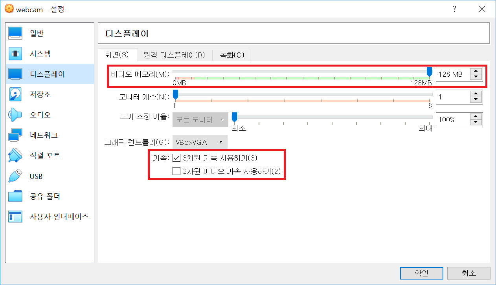
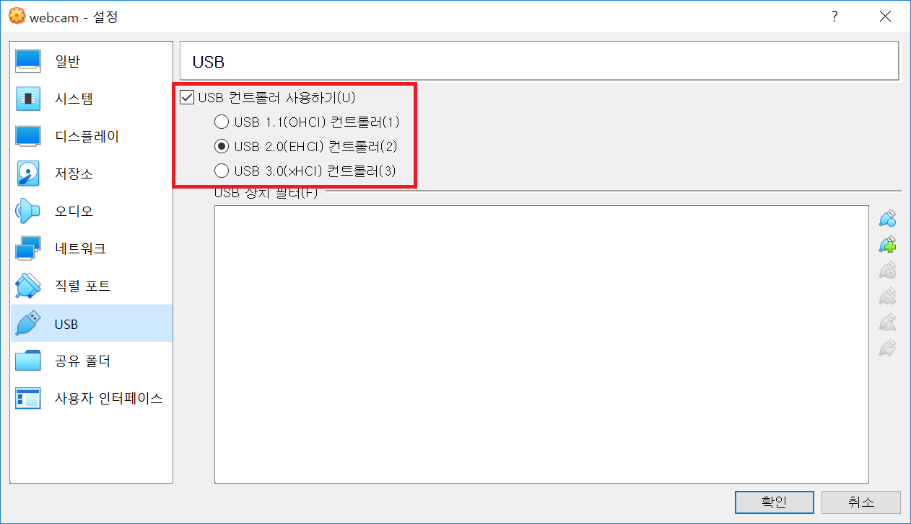

이제 Windows의 기본 환경 구성은 끝났습니다. 이제부터 webcam을 사용하고 싶을 때 매번 수행해야하는 과정들입니다.

1. __Docker Quickstart terminal__ 실행
2. `DOCKER_MACHINE=webcam` 또는 `DOCKER_MACHINE=default`
3. `docker-machine stop default` 실행 후, `docker-machine start ${DOCKER_MACHINE}`
    - 만약 __default__ 로 구성하였다면, 3번 무시
4. `eval $(docker-machine env ${DOCKER_MACHINE})`
5. `"/c/Program Files/Oracle/VirtualBox/VBoxManage" list webcams` 결과 확인, _아래 예시 참조_
6. `"/c/Program Files/Oracle/VirtualBox/VBoxManage" controlvm "${DOCKER_MACHINE}" webcam attach .1` 또는 `.2` 또는 둘 다
7. __Xming__ 실행

> 5번 출력 예시

```sh
# choose one or all if you want (two cameras in my case)
Video Input Devices: 2
.1 "c922 Pro Stream Webcam"
.2 "Logi Capture"
```

MacOS와 마찬가지로 webcam 테스트 이전에 Xming이 제대로 동작하고 있는지 확인해 보기 위해 아래의 두 가지 테스트를 진행해 보세요.

```sh
# xeyes
docker run --rm -it -e DISPLAY=192.168.99.1:0 gns3/xeyes

# firefox
docker run --rm -it -e DISPLAY=192.168.99.1:0 -v /tmp/.X11-unix:/tmp/.X11-unix jess/firefox
```

webcam을 사용할 docker image가 있다면, 아래 예시와 같이 해주시면 됩니다.

```sh
docker run --rm -it --device=/dev/video0:/dev/video0 \
  -v /tmp/.X11-unix:/tmp/.X11-unix \
  -e DISPLAY=192.168.99.1:0 \
  ${DOCKER_IMAGE}
```

[top](#)

### 정리

#### Webcam 테스트

아래는 `dlib` [4][4]의 예제를 실행시킨 결과이고, Windows의 경우 화면 녹화 프로그램을 쓰지 않고 캡쳐만 했습니다.

| MacOS | Windows |
|:-----:|:-------:|
| 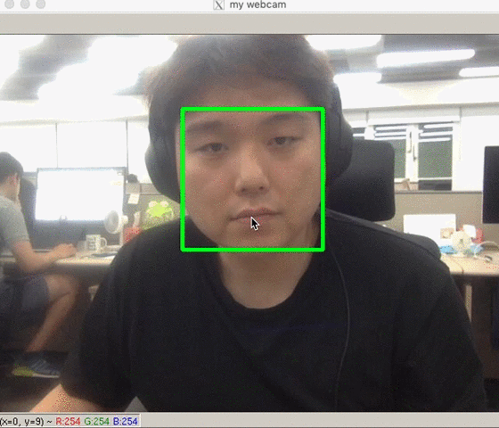 | 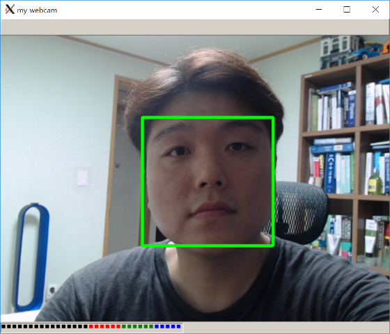 |

이제 Mac과 Windows에서도 webcam을 Docker에 연결하여 사용할 수 있습니다. 😁👍🏼

[top](#)

#### 결론

Mac이나 Windows에서 Webcam을 Docker와 연결시키는 것은 불가능한 것은 아닙니다. 다만, 최신 버전의 [boot2docker](https://github.com/boot2docker/boot2docker/releases)를 사용하지 않아 생길 수 있는 불편함이 있습니다. 또한, 이 글에서 제시한 방법 뿐만 아니라 Mac의 경우 [Parallels](https://www.parallels.com/)의 kernel을 이용할 수도 있고, Windows는 Pro나 Enterprise의 [Hyper-V](https://docs.microsoft.com/ko-kr/virtualization/hyper-v-on-windows/about/) 실제 사용해보지 않아 동작한다고 확신할 수 없습니다.

그럼에도 불구하고, Docker 환경을 통해 Webcam 또는 Camera를 제어할 수 있는 점은 참 매력적이고, 서로 다른 운영체제에서 개발을 해야하는 조직이라면 분명히 도움이 될 것입니다.

이 글의 튜토리얼을 따라해보면서 잘 되지 않는 부분은 댓글로 달아주세요.

[top](#)

#### 요약

- Mac
  1. __터미널 1__ `open -a XQuartz`
  2. __터미널 2__ `socat TCP-LISTEN:6000,reuseaddr,fork UNIX-CLIENT:\"$DISPLAY\"`
  3. __터미널 1__ `IP=$(ifconfig en0 | grep inet | awk '$1=="inet" {print $2}')`
  4. __터미널 1__ `xhost + $IP`
  5. __터미널 1__ `DOCKER_MACHINE=webcam`
  6. __터미널 1__ `docker-machine start ${DOCKER_MACHINE}`
  7. __터미널 1__ `eval $(docker-machine env ${DOCKER_MACHINE})`
  8. __터미널 1__ `vboxmanage list webcams` 결과 확인
  9. __터미널 1__ `vboxmanage controlvm "${DOCKER_MACHINE}" webcam attach .1`
- Windows
  1. __Docker Quickstart terminal__ 실행
  2. `DOCKER_MACHINE=webcam` 또는 `DOCKER_MACHINE=default`
  3. `docker-machine stop default` 실행 후, `docker-machine start ${DOCKER_MACHINE}`
  4. `eval $(docker-machine env ${DOCKER_MACHINE})`
  5. `"/c/Program Files/Oracle/VirtualBox/VBoxManage" list webcams` 결과 확인
  6. `"/c/Program Files/Oracle/VirtualBox/VBoxManage" controlvm "${DOCKER_MACHINE}" webcam attach .1`
  7. __Xming__ 실행

[top](#)

### 참고

[1]: https://vtluug.org/wiki/Socat
[2]: https://www.xquartz.org/
[3]: https://github.com/gzupark/boot2docker-webcam-mac/blob/master/README.md
[4]: https://github.com/davisking/dlib/blob/master/python_examples/opencv_webcam_face_detection.py
[5]: http://www.straightrunning.com/XmingNotes/

- https://github.com/boot2docker/boot2docker
- https://github.com/gzupark/boot2docker-webcam-mac
- https://github.com/Alexoner/boot2docker
- https://docs.docker.com
- https://www.virtualbox.org/manual/UserManual.html
- https://vtluug.org/wiki/Socat
- https://www.xquartz.org
- http://www.straightrunning.com/XmingNotes
- https://github.com/davisking/dlib
