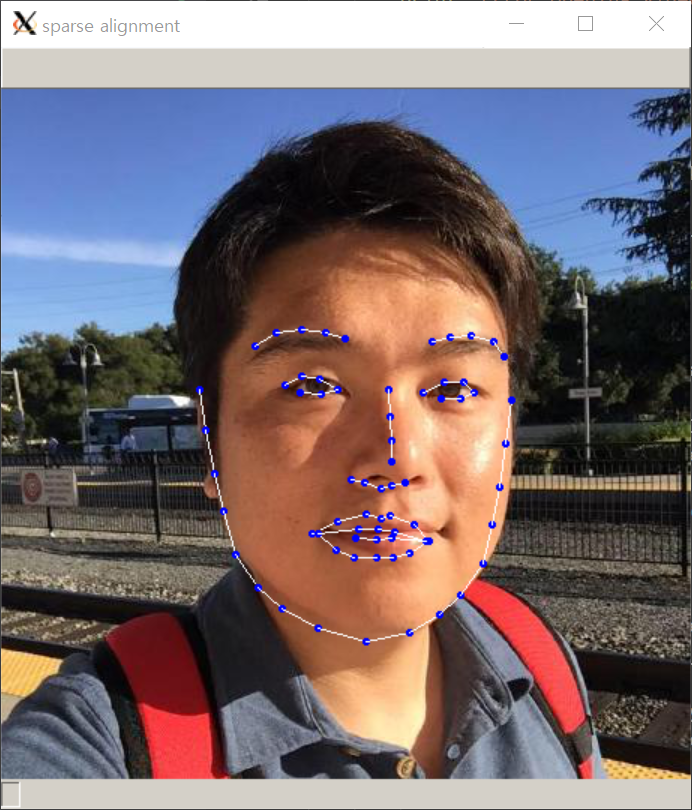

[ECCV 2018](https://eccv2018.org/event/eccv/) 에서 발표된 __Joint 3D Face Reconstruction and Dense Alignment with Position Map Regression Network__ 논문(이하 PRNet)을 가볍게 정리하고자 합니다.

### 첫 인상

논문의 요약만 보면 4가지 정도가 관심이 가는군요.

1. 얼굴 3D 정보를 UV mapping을 통해 2D로 표현합니다.
2. 단일 2D 이미지를 입력으로 받아 간단한 CNN을 통해 훈련합니다.
3. loss function을 계산할 때 (얼굴) 마스크에 가중치를 주었습니다.
4. 1장의 이미지를 처리하는데 9.8ms 밖에 걸리지 않습니다.

첫 느낌으로는 2번의 경우 대충 예상이 되는 흐름이고, 1과 3번에서 어떤 방법을 제시하는 것인가 매우 궁금했습니다.

4번의 말대로라면 어떤 환경인지 명시하지 않았지만 이론적으로 100FPS가 가능할 정도로 가볍고, 빠른 모델로 보이네요.

### 관심 부분 분석

#### 1. UV mapping

얼굴 뿐만 아니라 대부분의 3D 데이터를 사용하게 되면, 데이터에 있는 값이 sparse하다는 것이 가장 큰 문제입니다.

이 논문에서는 얼굴 3D 벡터 데이터를 2D 이미지로 변환하는데 RGB 채널이 x, y, z 좌표축을 표현한다는 신박한 아이디어를 제시합니다.

#### 2. CNN network

Image Segmentation 모델의 전형적인 형태로 훈련하는데 입력은 256 x 256 x 3 크기의 이미지, 출력도 마찬가지의 크기를 가집니다.

보통은 3차원 vertexset은 길게 펼쳐서(flatten) 네트워크를 통해 나온 값과 loss function으로 계산하기 위해 fully connected layer를 쓰는 경우가 많았습니다. 그렇게 되면, 모델의 파라미터 개수가 급격하게 늘어나서 모델이 무겁고, 당연히 추론 속도도 느려지게 되죠. 더불어 길게 펼쳐져버린 array는 3D 얼굴에서 서로 인접한 포인트에 대한 정보가 사라지게 됩니다.

#### 3. Weight loss function

앞서 언급한 바를 종합해보면, 출력의 이미지는 256 x 256 x 3의 크기를 가지는데 3 channel (RGB)가 각각 x, y, z축에 대응되기 때문에 서로 인접한 포인트의 정보를 가지고 갈 수 있습니다.

논문에서는 총 4종류의 loss weight를 주었고 아래와 같습니다.

| parts               | loss weight |
|:-------------------:|:-----------:|
| 68 facial landmarks | 16          |
| (eye, nose, mouth)  | 4           |
| (other face area)   | 3           |
| (neck)              | 0           |

아래의 가장 오른쪽 그림으로 설명을 하자면, 하얀 색 점이 68개의 얼굴 랜드마크이고, 눈코입의 영역으로 보이는 옅은 회색 영역, 나머지 얼굴 부위의 회색 영역, 그리고, 목 등이 표현되는 검은색 영역입니다.

### 따라해보기

논문의 저자가 친절하게 실행 가능한 [코드](https://github.com/YadiraF/PRNet)를 공유해 주었고, 모델의 [checkpoint](https://drive.google.com/file/d/1UoE-XuW1SDLUjZmJPkIZ1MLxvQFgmTFH/view?usp=sharing)도 공유해 주었습니다. 🤓

처음 테스트할 땐 README의 Prerequisite를 따라 Python 2.7에서 실행했지만 Python 3.6에서도 실행가능합니다([참고](https://github.com/YadiraF/PRNet/runs/24578222)). 테스트 환경은 Window 10 운영체제에서 docker를 통해([참고](https://gzupark.github.io/blog/Connect-Webcam-to-Docker-on-Mac-or-Windows/)) CPU만 사용하였습니다.

아래의 결과는 default인 `--idDlib True`로 설정하여 dlib의 face detector를 사용한 것입니다.

| sparse | pose | dense |
|:------:|:----:|:-----:|
|  |  |  |

Wired frame을 얼굴에 씌운 듯한 결과는 만족스럽니다. 하지만, 얼굴의 랜드마크를 찍은 결과는 얼굴 전체가 약간 왼쪽으로 치우쳐있어서 제 코와 입이 삐뚤어져버렸군요...

오! 이렇게 형태만 보니까 신기하네요, 그러면 여기에 제 얼굴 이미지를 덧씌워서 3D Face Reconstruction을 해보겠습니다.

우선 UV map형태로 나온 제 얼굴을 확인해보겠습니다.

__?!?!__ 얼굴 전체가 왼쪽으로 shift된 결과가 위 사진에도 고스란히 나타나고 있습니다. 아래의 그림처럼 제 코는 뭉개져버렸고, 귀는 시커멓게 되버렸습니다.

### 정리 및 아쉬운 점

PRNet은 정말 매력적인 아이디어입니다. 3D vertor를 이미지의 RGB channel처럼 사용하여 image segmentaion의 방법처럼 2D 이미지를 재생성하는 것이 3D를 재생성하는 것과 같은 효과를 보여줄 수 있다는 것에 매력을 느꼈습니다. 또한, 위에서 자세하게 언급하지 않았지만 데이터의 augmentation하는 것과 UV mapping을 하기 위해 Tutte embedding을 제안한 것 등 자세하게 읽다보면 도움이 되고, 영감을 얻을 수 있었습니다.

한 가지 아쉬운 점은 `dlib`을 사용하지 않으면, 제 환경에서 5FPS 가까이 낼 수 있었지만 결과가 너무 좋지 않았고, 원인을 파악해보니 데모 코드에서 사용되는 이미지는 얼굴 roi가 필요한데 이미지 전체를 넣다보니 얼굴을 제대로 추론할 수 없었습니다. 그리고, `dlib`을 사용하게 되면, 이미지를 resizing을 하지 않아 시간이 꽤 걸린다는 점입니다. 웹캠으로 실시간 움직임을 테스트해보고 싶었으나 당장 해보지 못한게 좀 아쉽네요.

### 더 좋게

논문에서도 나온 이야기지만 모델 network를 MobileNet, ResNet을 사용해보거나 전체적인 구조를 널리 쓰이는 UNet으로 변경해보는 등의 실험을 하면 좋을 것 같습니다. 또는, Clova의 [EXTD](https://arxiv.org/abs/1906.06579) 모델의 아이디어를 응용해본다던가 Facebook research의 [Kill the bits](https://arxiv.org/abs/1907.05686) 방법을 적용해보는 것도 좋겠네요. 아니면, 저자의 결과 [영상](https://youtu.be/tXTgLSyIha8)에서 알 수 있듯이 양쪽 귀 부분이 상당히 불안정하여 떨리는 것을 보정해줄 수 있는 방법을 도전해봐도 될 것 같습니다.

### 참고

- Joint 3D Face Reconstruction and Dense Alignment with Position Map Regression Network, [paper](http://openaccess.thecvf.com/content_ECCV_2018/papers/Yao_Feng_Joint_3D_Face_ECCV_2018_paper.pdf), [code](https://github.com/YadiraF/PRNet)
- [Bridging the Academia Gap: An Implementation of PRNet Training](https://medium.com/@hyprsense/bridging-the-academia-gap-an-implementation-of-prnet-training-9fa035c27702)
- [딥러닝으로 나의 3D 아바타 얼굴 만들기](https://blog.naver.com/atelierjpro/221279748395)
- EXTD: Extremely Tiny Face Detector via Iterative Filter Reuse, [paper](https://arxiv.org/abs/1906.06579), [code](https://github.com/clovaai/EXTD_Pytorch)
- And the Bit Goes Down: Revisiting the Quantization of Neural Networks, [paper](https://arxiv.org/abs/1907.05686), [code](https://github.com/facebookresearch/kill-the-bits)
