### 개요

__AR__ ([Augmented Reality](https://en.wikipedia.org/wiki/Augmented_reality))은 이미 방송과 모바일 등 다양한 형태로 서비스되고 있어서 이미 친숙하다는 느낌이 들 것입니다.
그 바탕에는 하드웨어의 큰 발전과 딥러닝 기반의 소프트웨어가 보편화된 점이 큰데요.
처리해야할 데이터가 큰 3D와 실시간 Computer Vision 서비스를 하기 위해서는 고가의 모바일 기기나 최적화가 잘 된 모델을 쓰는 것이 좋습니다.

이 글에서는 그 시작점이라고 할 수 있는 두 개의 이미지를 합성시키는 매우 뻔한 2D 서비스를 구현해보려고 합니다.

> 코드는 [GitHub](https://github.com/gzupark/put_sunglasses_on_your_face)에서 확인하실 수 있습니다.

### 목표

사람의 얼굴이 있는 이미지에 안경이나 수염 등의 이미지를 합성하는 방법은 구글링을 하면 금방 찾을 수 있을 정도로 많이 알려져 있습니다.
단, 쉽게 검색할 수 있는 방법들은 주어진 이미지에 아이템을 합성시킬 관심 영역(ROI: Region of Interest)을 미리 알고 있어야 하는 경우가 많습니다.

여기서는 구현되어 있는 Computer Vision 알고리즘을 통해 얼굴을 찾고 적당한 얼굴 위치에 선글라스를 얹으려고 합니다.

### 첫 번째 방법

얼굴에 선글라스를 얹을 적당한 위치를 정하려면, 얼굴의 Landmarks를 보고 정해주는게 좋을 것 같습니다. Face detection과 landmarks 모두 [dlib](http://dlib.net/)을 사용하겠습니다.

우선 선글라스 이미지를 보면, 프레임과 렌즈를 제외한 배경은 투명처리가 되어 있고, 이미지 크기에 맞는 직사각형 형태입니다.

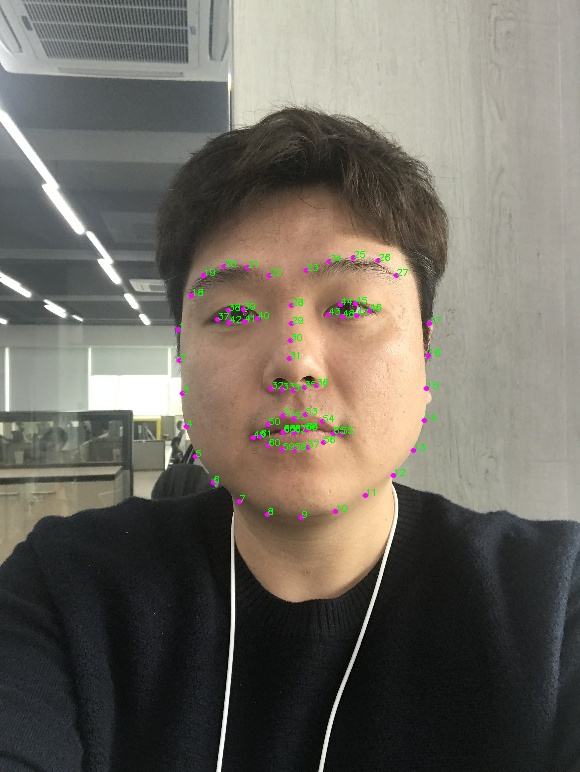

그리고 얼굴의 landmarks를 보면, 총 68개 중에서 선글라스 이미지가 적당하게 들어오려면 양 눈썹 끝인 18번과 27번에 이미지의 좌측 상단과 우측 상단이 오면 좋을 것 같습니다.

위의 아이디어를 위해 두 개의 정보가 필요한데,

1. 18번과 27번 landmarks 거리
2. 28번 landmark가 일치한다는 가정하에 선글라스 코받침의 좌표

1번의 경우 선글라스 이미지 크기와의 비율을 통해 Scale 정보를 얻을 수 있고, 2번의 경우 선글라스 이미지 넓이의 중간에 가까운 포인트를 가져가지 않을 경우 선글라스가 코에 얹혀 있는 합성 결과를 얻을 수 없기 때문입니다. 그리고, 2번 정보는 선글라스 이미지와 함께 미리 [좌표](https://raw.githubusercontent.com/GzuPark/put_sunglasses_on_your_face/c8cb8f3b8b5723d337da78aed5fde8bd27beeec0/assets/images/sunglasses/example1.txt)를 정해 놓았습니다.

아래의 이미지들은 각각 얼굴의 정면, 좌측(soft, hard), 우측(soft, hard)의 결과입니다.

| Hard Left | Soft Left | Soft Right | Hard Right |
|:---------:|:---------:|:----------:|:----------:|
| 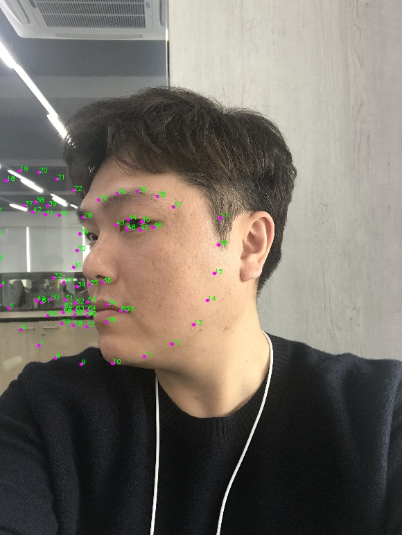 | 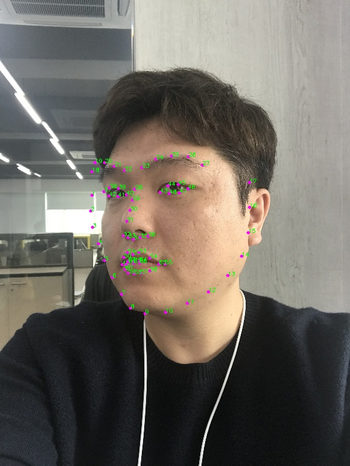 | 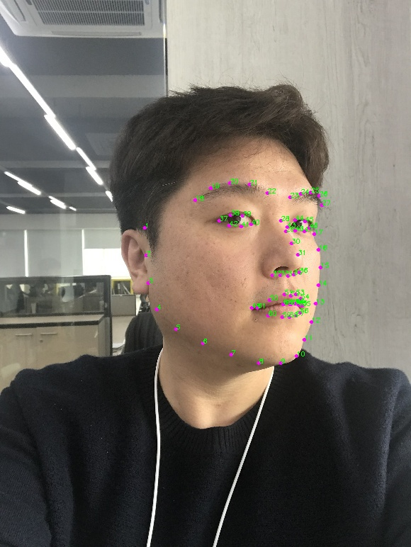 | 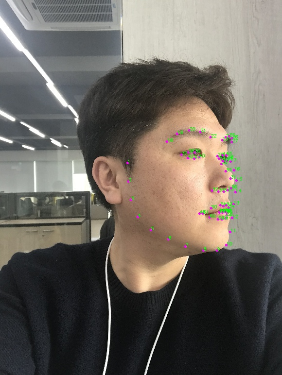 |

| Soft Left | Center | Soft Right |
|:---------:|:------:|:----------:|
| 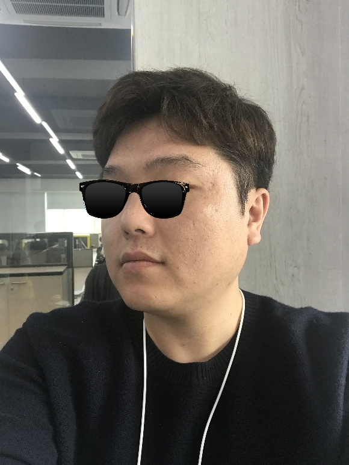 |  | 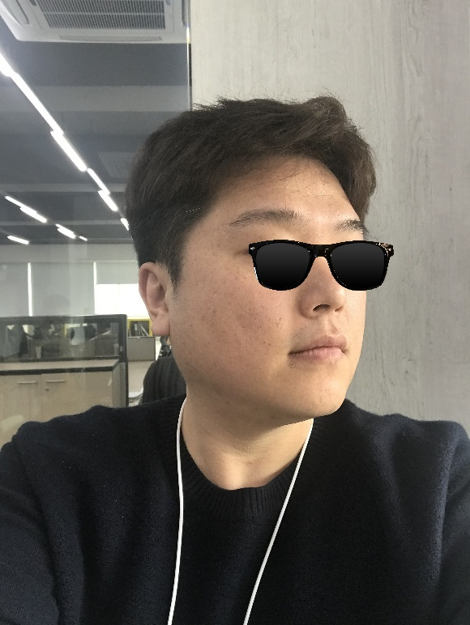 |

| Hard Left | Center | Hard Right |
|:---------:|:------:|:----------:|
|  |  | 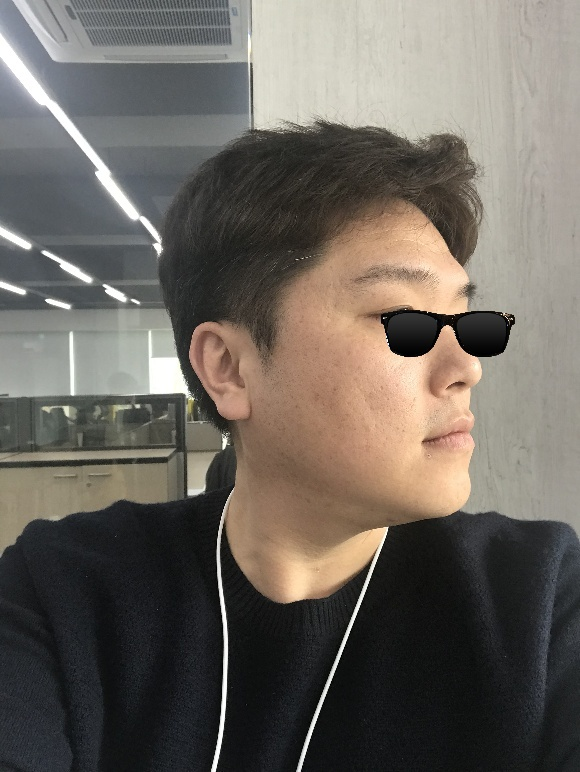 |

위 이미지들의 문제점을 말하자면,

1. Frontal face detector 알고리즘을 사용하기 때문에 얼굴의 좌우 회전 각도가 크다면 얼굴 인식을 못 함
2. Face landmark 알고리즘도 마찬가지로 정면 얼굴을 기준으로 찾기 때문에 포인트가 부정확하게 결정됨
3. 얼굴을 돌렸는데도 불구하고 선글라스는 회전을 하지 않아 어색함

1, 2번의 문제점은 Side face detection이 잘 되는 알고리즘을 쓰면 해결할 수 있는데 여기서 다루지 않고, 결론에 아이디어만 적어놓겠습니다.

3번의 문제점을 해결하려면 필요한 정보가 무엇일까요? 얼굴을 좌우로 돌리는 각도에 대해 알 수 있다면 이미지를 회전시킬 수 있을 것 같습니다.

### 두 번째 방법

우선 3D에서 얼굴을 회전할때 기준이 되는 축에 따라 붙여지는 명칭을 알아보겠습니다.

출처: Head nod detection from a full 3d model, <i>Chen et al</i>

위 내용을 행동 예시와 함께 풀어서 설명하자면,

- __Pitch__ : 고개를 끄덕거리는 행위는 __x__ 축을 중심으로 회전
- __Yaw__ : 고개를 좌우로 흔드는 행위는 __y__ 축을 중심으로 회전
- __Roll__ : 목 좌우의 근육을 늘려주 둣이 머리를 회전하는 행위는 __z__ 축을 중심으로 회전

Face landmarks 중 미리 선정한 포인트들이 정면일 때와 비교하여 얼마나 회전했는가에 대한 정보를 얻는다면, pitch, yaw, roll 각도를 알 수 있습니다. 여기서는 pitch 각도에 대한 정보는 무시하고 진행하려고 합니다.

이제 알고 있는 yaw, roll 각도에 따라 선글라스 이미지를 각 축에 맞게 회전 시켜주겠습니다.

| Soft Left | Center | Soft Right |
|:---------:|:------:|:----------:|
| 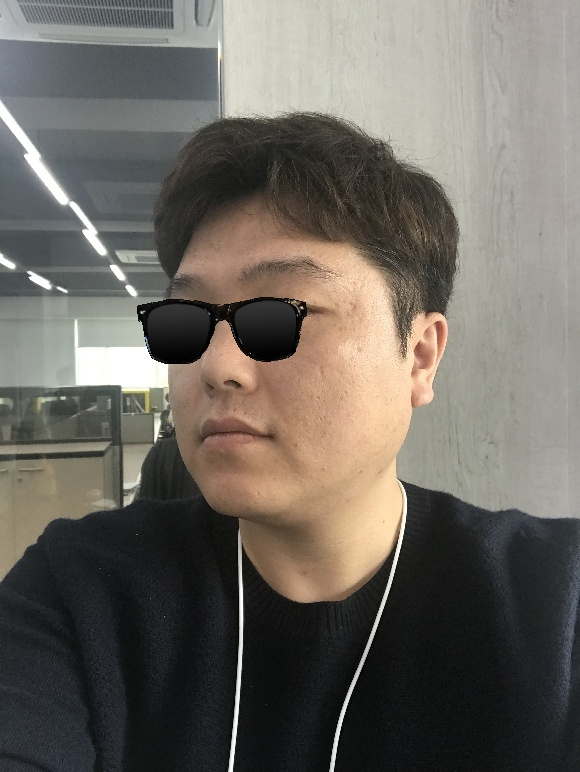 | 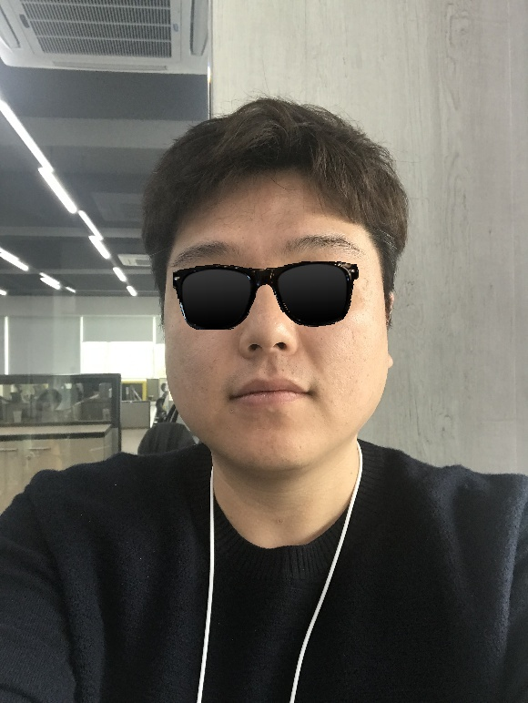 |  |

| Hard Left | Center | Hard Right |
|:---------:|:------:|:----------:|
| 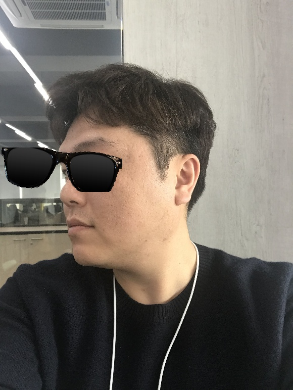 |  | 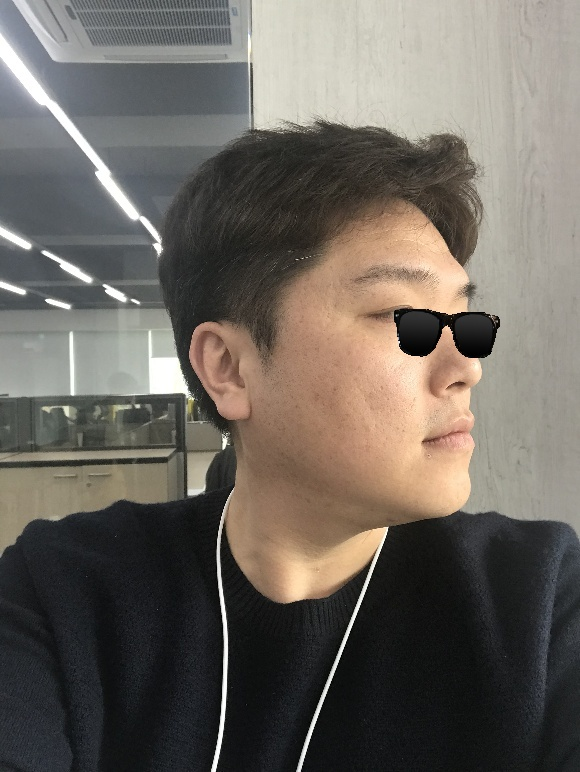 |

비록 선글라스 이미지의 퀄리티가 떨어져 보이지만 얼굴이 돌아가는 각도에 따라 선글라스가 같이 돌아가는 것을 볼 수 있습니다.

하지만 이 방법도 문제점이 생기는데요, yaw 회전의 경우 별다른 문제가 없는데 roll 회전을 할 경우 선글라스는 각도에 맞게 회전을 하는데 선글라스 이미지를 변환할 때 정해진 크기의 캔버스(여기서는 직사각형의 ROI) 안에서 회전하다보니 캔버스 크기에 벗어나는 이미지는 잘려버리고 말았습니다.

이 문제를 해결할 수 있는 방법이 있을까요? 선글라스 이미지 크기의 2배 이상되는 투명한 캔버스에 크기가 그대로인 선글라스 이미지를 중앙에 두는 것으로 소위 이미지 패딩을 해야할 것입니다. 그러면, 추가적으로 양 눈썹 끝의 포인트와 맞는 선글라스 양 끝 부분의 포인트 정보도 필요하게 되겠네요. 😫

## 마무리

조용히 이 작업을 지켜보던 동료가 한 마디 합니다.

"안경 다리는 어디 갔어요?"

위에서도 언급했듯이 dlib에서 사용하는 face landmarks 알고리즘이 얼굴 정면을 기준으로 했기 때문에 yaw 회전을 했을 경우 원하는 위치를 찾기 어렵습니다. 결국 얼굴 정면에서만 한정되는 알고리즘을 사용한다는 것이 문제인데 side face detection 알고리즘을 활용하여 [PRNet](http://openaccess.thecvf.com/content_ECCV_2018/papers/Yao_Feng_Joint_3D_Face_ECCV_2018_paper.pdf)을 통해 3D landmarks를 얻어 2D에 projection 시킨다면, 얼굴 회전을 반영한 2D landmarks를 알 수 있을텐데요. 이렇게 아이디어만 이야기하고 애써 웃음 지었습니다. 😎

이 글에서 사용한 코드는 [GitHub](https://github.com/gzupark/put_sunglasses_on_your_face)에서 확인할 수 있고, webcam을 써서 실시간으로 사용해볼 수도 있습니다.

### 참고

- [Put sunglasses on your face](https://github.com/gzupark/put_sunglasses_on_your_face)
- [Head nod detection from a full 3d model, _Chen et al_](https://www.cv-foundation.org/openaccess/content_iccv_2015_workshops/w12/html/Chen_Head_Nod_Detection_ICCV_2015_paper.html)
- [Head Pose Estimation using OpenCV and Dlib](https://www.learnopencv.com/head-pose-estimation-using-opencv-and-dlib/)
- [Joint 3D Face Reconstruction and Dense Alignment with Position Map Regression Network, _Yao Feng_](http://openaccess.thecvf.com/content_ECCV_2018/papers/Yao_Feng_Joint_3D_Face_ECCV_2018_paper.pdf)
